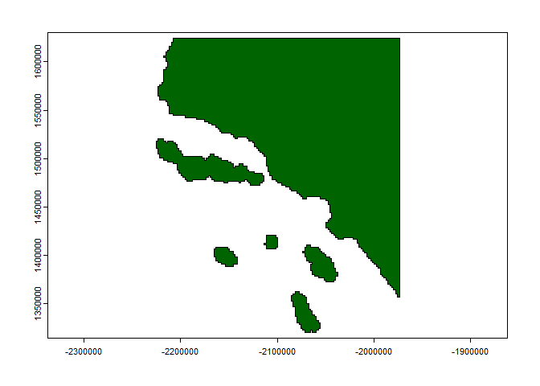
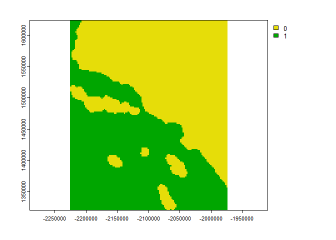
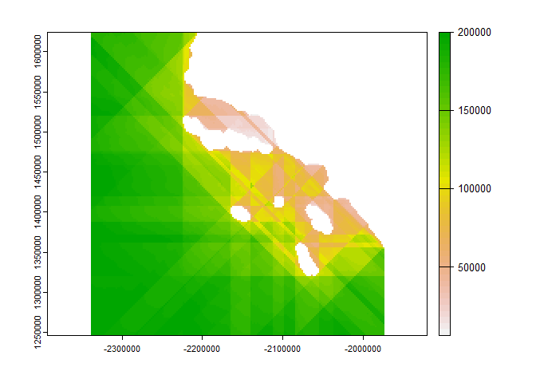

<!-- README.md is generated from README.Rmd. Please edit that file -->

# fetchr 

<!-- badges: start -->

[](#)
[](https://choosealicense.com/licenses/mit/)
<!-- badges: end -->

<div align="left">

<p align="left">
<a href="https://en.wikipedia.org/wiki/Wind_fetch"><strong>« Fetch
»</strong></a> <br />
</p>

</div>

<hr>

The goal of **`fetchr`** is to provide a fast and efficient raster based
method for calculating fetch lengths across thousands of water grid
cells. Calculating fetch lengths, the distance that wind can blow in a
constant direction over a body of water without interruption, can be a
slow and memory intensive process when done on thousands of points of
interest in multiple directions. **`fetchr`** attempts to fix this
problem and allows for thousands of fetch calculations to be performed
in a fraction of the time that other methods take.

<hr>

## Installation

You can install the development version of **`fetchr`** from
[GitHub](https://github.com/anguswg-ucsb/fetchr) with:

``` r
# install.packages("devtools")
devtools::install_github("anguswg-ucsb/fetchr")
```

## Coastline raster

If we start with a raster representing the Southern California coast
near Santa Barbara, CA.

``` r
library(fetchr)

# land raster
land_rast <- terra::rast(fetchr::land)

terra::plot(land_rast, col = "#2e8b57")
```



<br>

## Make a binary land water rasters

We can take this land raster, indicate which cells are water cells, and
create a binary land water raster (land = 0, water = 1).

``` r
# binary land water raster 
landwater <- fetchr::get_landwater(
  r           = land_rast,                 # land raster
  water_value = NA,                        # cells with a value of NA are classified as water, all other cells are land
  res         = terra::res(land_rast)[1]   # return raster with the same cell resolution as input raster
  )
#> Creating landwater raster...

terra::plot(landwater, col = c("#2e8b57", "#add8e6"))
```



This raster now meets all the specification for using **`get_fetch()`**:

-   Binary cell values (land cells = 0 and water cells = 1)
-   Projected Coordinate Reference System
-   Regular grid cell size (same x and y cell resolution)

<br>

## Calculate fetch length

Internally, **`get_fetch()`** will coerce polygon/multipolygon
geometries and rasters into the required binary landwater raster. It is
recommended to provide either an `sf`/`terra` polygon or a
`raster`/`terra` raster with a single value for land cells and NA values
for water cells. To calculate fetch distances, we can simply provide an
`sf`/`terra` polygon or `raster`/`terra` raster to **`get_fetch()`**,

``` r
system.time(
  
  fetch <- fetchr::get_fetch(
    r        = land_rast,     # binary land water raster
    max_dist = 200000,        # maximum distance to calculate fetch in meters (200km)
    ncores   = 12,            # number of computer cores to use 
    verbose  = TRUE
    )
  
)
#> Calculating Fetch...
#> Calculating north/south/east/west distances
#> Calculating diagonal distances
#>    user  system elapsed 
#>    5.20    0.33   12.19

plot(fetch)
```



**In this example here, calculating fetch distances for \> 24,000 water
cells took about \~12 seconds, or \~0.00083 seconds per point. That is a
\~ 99.92% reduction in computation time compared to various other
polygon based methods out there!**
