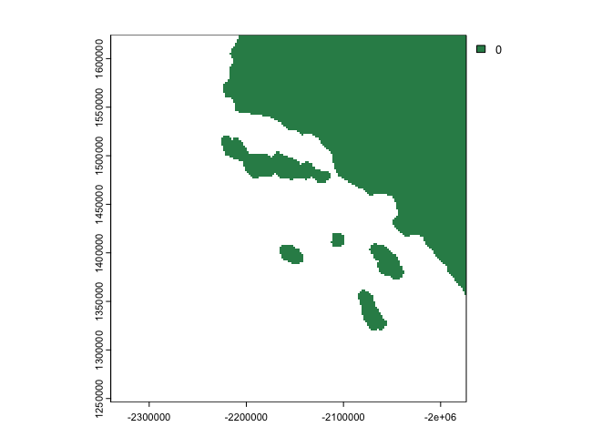

<!-- README.md is generated from README.Rmd. Please edit that file -->

# fetchr

<!-- badges: start -->
<!-- badges: end -->

Calculating fetch lengths, the distance that wind can blow in a constant
direction over a body of water without interruption, can be a slow and
memory intensive process when done on thousands of points of interest in
multiple directions. The goal of `fetchr` is to provide a fast and
efficient raster based method for calculating fetch lengths across
thousands of water grid cells.

## Installation

You can install the development version of fetchr from
[GitHub](https://github.com/) with:

``` r
# install.packages("devtools")
devtools::install_github("anguswg-ucsb/fetchr")
```

## Example

If we start with a polygon that represents the Southern California coast
near Santa Barbara, CA.

``` r
library(fetchr)

land_poly <- terra::vect(fetchr::land_vect)
terra::plot(land_poly, col = "darkgreen")
```



We can rasterize this land polygon and create a binary raster with land
cell values of 1 and water cell values of 0. What is special about using
`README.Rmd` instead of just `README.md`? You can include R chunks like
so:

``` r
landwater <- fetchr::get_landwater(
  r           = land_poly,
  water_value = NA,
  res         = 2000
  )
#> Rasterizing SpatVect...
#> Resolution: 2000 x 2000

terra::plot(landwater)
```


You’ll still need to render `README.Rmd` regularly, to keep `README.md`
up-to-date. `devtools::build_readme()` is handy for this. You could also
use GitHub Actions to re-render `README.Rmd` every time you push. An
example workflow can be found here:
<https://github.com/r-lib/actions/tree/v1/examples>.

You can also embed plots, for example:


In that case, don’t forget to commit and push the resulting figure
files, so they display on GitHub and CRAN.
